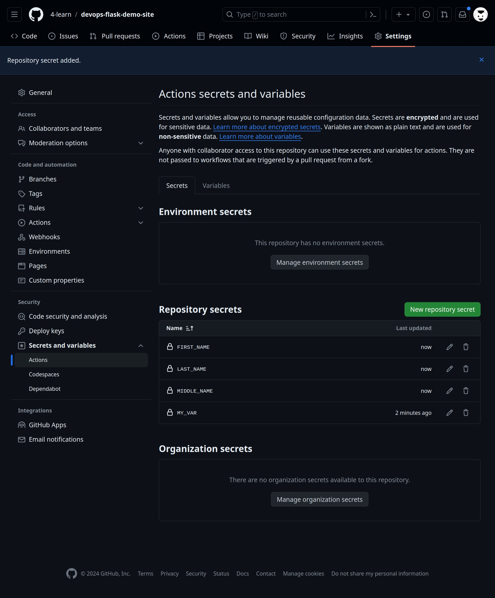

# 運作流程

## 設定環境變數
  - Settings
  - Secrets and Variables
  - New repository secret



## 複製 GitHub Action 到 .github 資料夾
```bash=
$ mkdir -p ../../.github/workflows
$ cp mona.yml ../../.github/workflows
```

## 觸發 push event
```bash=
$ git add ../../.github/workflows/ ; git commit -m "example: Greeting-from-Mona" ; git push
```

## GitHub Action 畫面


